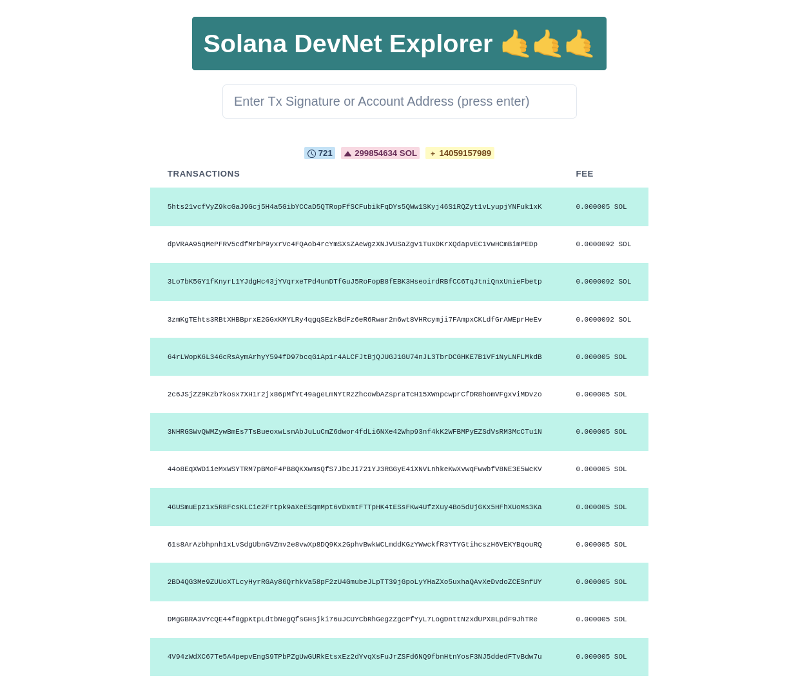
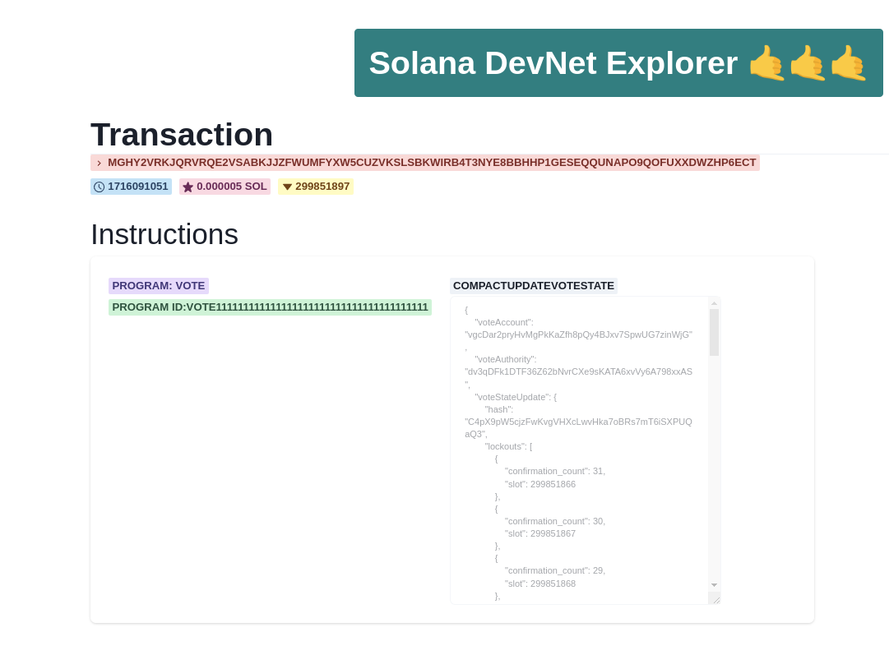
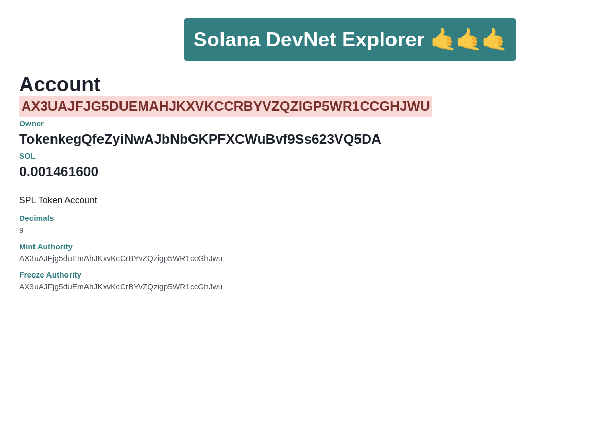

# Solana DevNet Explorer

A basic Solana blockchain explorer that is meant to be simple and fast.

Live Demo:
https://solana-explorer-talent-olympics.vercel.app/



# Transaction Page
Transaction details like signature, block time, fees and slot times are shown. Also, instructions within the transaction are showed with common programs names if available and the parsed information.


# Account Page

Basic account information are shown. The page will show "Program" if the account is executable. Also, for SPL token mints and accounts it will show additional information such as mint authority, freeze authority, owners and all relevant SPL token information

## tech stack
- Next JS + React

## installation
- Install dependencies
```
npm install
```

- Run a dev server
```
npm run dev
```

- Build
```
npm run build
```